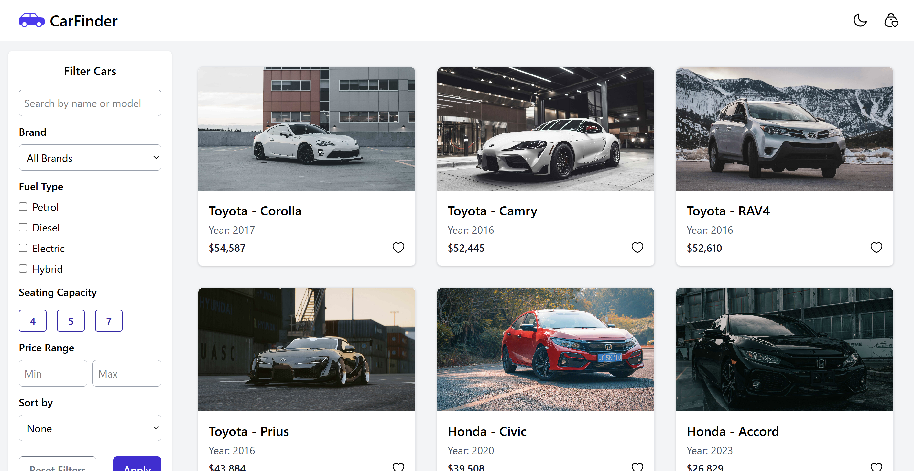
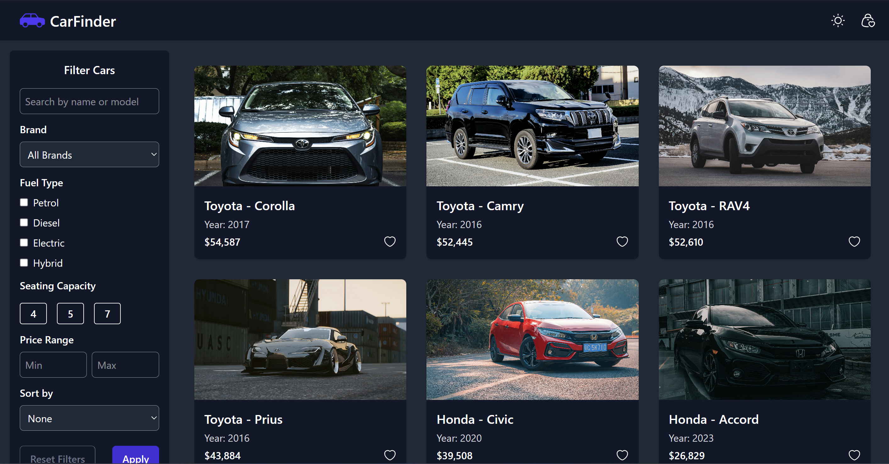
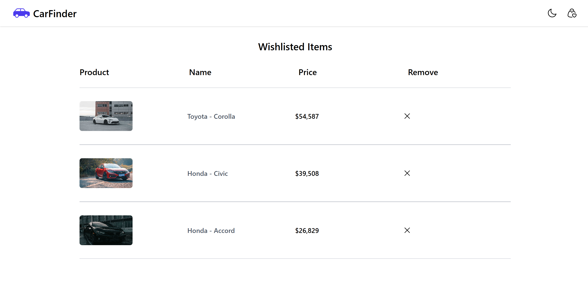
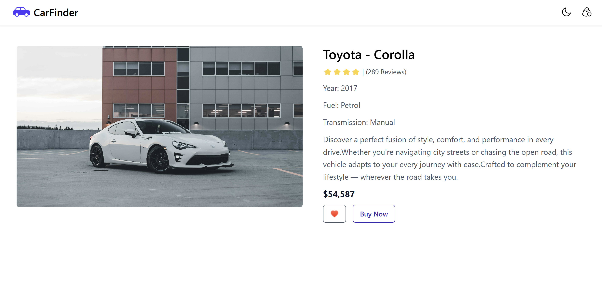

# 🚗 Car Finder App

A sleek and responsive **Car Finder Web Application** built with **Next.js**, **React**, and **TailwindCSS**. Easily search, filter, and explore a curated list of cars. Wishlist your favorites and enjoy both light and dark themes!

---

## ✨ Features

- 🔍 **Car Search** – Instantly find your dream car with live search functionality.
- 🛠️ **Advanced Filtering** – Filter cars by brand, price, fuel type, and more.
- 💖 **Wishlist Support** – Save your favorite cars to view them later (stored in `localStorage`).
- 🌗 **Dark Mode** – Toggle between light and dark themes.
- ⚡ **Responsive Design** – Looks great on all devices, from mobile to desktop.
- 🚀 **Fast Performance** – Built with Next.js for optimized performance and routing.
- 🔔 **Toasts & Notifications** – Smooth feedback using `react-hot-toast`.

---

## 📸 Screenshots

### 🏠 Home Page (Light Mode)


---

### 🌙 Home Page (Dark Mode)


---

### 💖 Wishlisted Cars


---

### 🚘 Car Details View


---

## 🛠️ Tech Stack

| Category             | Tech                                                   |
|----------------------|--------------------------------------------------------|
| **Framework**        | [Next.js](https://nextjs.org/)                         |
| **Frontend**         | [React](https://reactjs.org/)                          |
| **Styling**          | [Tailwind CSS](https://tailwindcss.com/)              |
| **Icons & UI**       | [Hugeicons](https://hugeicons.com/)                   |
| **Toasts**           | [react-hot-toast](https://react-hot-toast.com/)       |
| **State Management** | React Hooks, `localStorage`                            |

---

## 🚧 Getting Started

To run the app locally:

```bash
# 1. Clone the repository
git clone https://github.com/shelavalepallavi/carfinder.git

# 2. Navigate to the project folder
cd carfinder.git

# 3. Install dependencies
npm install

# 4. Run the development server
npm run dev
Open http://localhost:3000 in your browser.
```
📁 Project Structure
```
carfinder/
├── app/
│   ├── api/
│   │   └── cars/
│   │       └── route.js               # API route for car data
│   ├── cars/
│   │   └── [id]/
│   │       └── page.js                # Car details page
│   ├── wishlist/
│   │   └── page.js                    # Wishlist page
│   ├── components/
│   │   ├── CarList.jsx
│   │   ├── CarDetails.jsx
│   │   ├── Filter.jsx
│   │   └── Navbar.jsx
│   ├── context/
│   │   └── carContext.js              # React context for app state
│   ├── global.css                     # Tailwind global styles
│   ├── layout.js                      # App layout with navbar and theme toggle
│   └── page.js                        # Home page
├── data/
│   └── dummy_car_data.json            # Sample car dataset
├── public/
│   └── images/
│       ├── home-light.png
│       ├── home-dark.png
│       ├── wishlist.png
│       └── car-details.png
├── package.json
└── README.md

```


🙏 Acknowledgments

Unsplash and Pixels for placeholder car images


## 🔗 Links

- **👨‍💻 Developed by:** Your Name
- **💻 GitHub:** [https://github.com/shelavalepallavi/carfinder.git](https://github.com/shelavalepallavi/carfinder.git)
- **🌐 Live Demo:** [carfinder-two.vercel.app](https://carfinder-two.vercel.app)
  
Let me know if you want to add a profile image or badge too!


🤝 Contributing
Contributions are welcome!
Feel free to fork, create a feature branch, and submit a pull request 🚀
